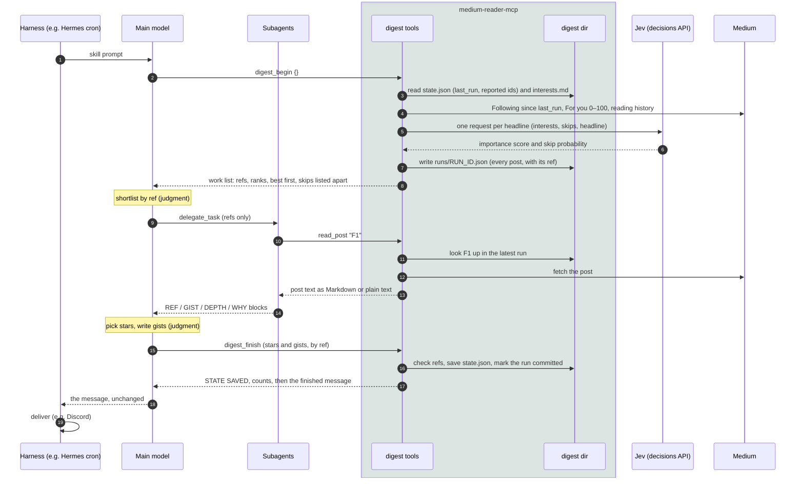

# Digest tools: a worked example

This page follows one small digest run from start to finish: what each tool takes, what it returns, and where every piece of the final message comes from. [digest.md](digest.md) explains why the tools exist and how to customize them.

The posts, authors and URLs are made up. Every block marked *output* is real, though: `test/docs-example.test.ts` runs this exact scenario through the server (with a fake Medium and a fake Jev), using the arguments shown here, and fails if any output on this page no longer matches.

## The whole run



The model only judges, at the two notes: which refs to read, and which to star and how to sum them up. Fetching, ranking, deduplication, layout and state are the server's job.

**Where each part of the final message comes from**

| Part of the message | Written by |
|---|---|
| Titles, authors, publications, URLs, `[member]`, Medium's reasons ("Selected for you") | The server, from the run file |
| Gists and *Why* lines | The main model, in `digest_finish`'s arguments. It rewrites them from the subagents' blocks; the subagents never call `digest_finish` |
| Header counts, "Also new", the 🗑 and 🔽 lines | The server |
| Layout and order | The server (`src/digest/render.ts`) |

## 1. `digest_begin`

Collects everything new since the last run, ranks it, and writes a run file. It saves no state. Call it with no arguments; the others are for testing and unusual days.

A second call while the latest run is unfinished and under 90 minutes old returns that run (same refs, nothing fetched) instead of starting another, so a retry after a timeout or a subagent calling `digest_begin` can't renumber the posts under the main model. The continued view leaves out the "then call `digest_finish`" line. Passing `since` always starts a new run.

<!-- args: digest_begin -->
| Field | Default | Meaning |
|---|---|---|
| `since` | `last_run` from `state.json` | Start point instead: an ISO time or `"48h"` |
| `following_max` | 400 | Most Following posts to collect |
| `top_picks` | 25 | "For you" positions below this are Medium's top picks |
| `for_you_end` | 100 | Read "For you" up to this position |
| `for_you_min` | 20 | If fewer new "For you" posts than this… |
| `for_you_extend_to` | 150 | …read on to this position (never past 250) |
| `history` | 45 | Reading-history posts used for the `R` flag |
| `max_chars` | 40,000 | Size limit for the work list; the lowest-ranked rows go first |

The example's `state.json` has `last_run` a day earlier and one post already reported. Arguments:

<!-- example: digest_begin -->
```json
{}
```

While collecting, the server asks Jev about each headline. This is the request for the first post:

<!-- generated: jev_request -->
```json
{
  "model": "typesafe/jev-1.13",
  "state": {
    "reader": {
      "interests": [
        "Backend engineering: databases, distributed systems, performance work with real numbers",
        "AI engineering: agents, evaluation, LLMs in production",
        "Self-hosting and home labs"
      ],
      "skips": [
        "Income claims and get-rich-quick stories"
      ]
    },
    "headline": {
      "title": "Postgres VACUUM, measured on a 2 TB table",
      "subtitle": "",
      "author": "Ana Ruiz",
      "publication": "Better Databases"
    }
  },
  "questions": {
    "importance": {
      "type": "score",
      "instructions": "Given the reader's interests and skips, how much would this reader want to read this post?",
      "criteria": [
        "Not for this reader: off-topic or matches a skip pattern",
        "Marginal: related area, little reason to open it",
        "Worth a skim",
        "Must read: squarely in the reader's interests with real substance"
      ]
    },
    "skip_ctx": {
      "type": "noul",
      "instructions": "Should this post be dropped because it matches one of the reader's skips?"
    }
  }
}
```

The fake Jev here answers F1 with `{"importance": {"type": "score", "score": 2.85}, "skip_ctx": {"type": "noul", "noul": 0.02}}`. The score is on the four-level scale (0–3), so F1's rank is 2.85 / 3 = 95. A skip probability of 70% or more drops the post (`MEDIUM_READER_DIGEST_SKIP_THRESHOLD`). Output:

<!-- generated: digest_begin -->
```text
Medium digest run 20261004T111522Z · member: yes
Since: Sat, Oct 3, 7:15 AM EDT (2026-10-03T11:15:07Z)
Following: 5 new (1 already reported) · Top picks: 2 (5 dropped) · For you: 2 from positions 25–100 (1 dropped)
Classifier jev (typesafe/jev-1.13): 9 ranked · 1 skipped (threshold 70%)
You read: @samlee ×1, @raequinn ×1 | Applied AI Notes ×2
Interests:
- Backend engineering: databases, distributed systems, performance work with real numbers
- AI engineering: agents, evaluation, LLMs in production
- Self-hosting and home labs
Columns: ref | rank (0–100, the classifier's guess at how much you'd want it; rows are sorted by it) | title | author | publication | minutes | claps | flags (M member-only, R you read this author/publication) [| reason]
## Following
F1 | 95 | Postgres VACUUM, measured on a 2 TB table | Ana Ruiz | Better Databases | 14 | 412 | M
F2 | 91 | Evaluating agents without fooling yourself | Sam Lee | Applied AI Notes | 11 | 1.3k | R
F3 | 72 | My home lab runs on three mini PCs | Jo Park | - | 7 | 96 | -
F4 | 21 | Ten morning habits of senior engineers | Max Doe | Career Lift | 4 | 2.3k | -
## Top picks
T1 | 83 | Raft in 200 lines of Go | Lena Ito | Systems Weekly | 18 | 3.4k | - | follow:Distributed Systems
T2 | 66 | Why we left Kubernetes | Omar Haddad | - | 9 | 7.8k | M | selected
## For you
Y1 | 61 | What the 2026 layoffs data actually shows | Rae Quinn | Applied AI Notes | 12 | 640 | R | network
Y2 | 55 | The case for boring technology, revisited | Ted Vos | - | 8 | 210 | - | history
## Skipped by classifier
F5 I made $12k in a month with AI side hustles
Next: shortlist ≤10 F, ≤5 T, ≤10 Y refs (rows are best-ranked first; prefer them unless a lower one clearly fits the Interests better); read them with subagents (read_post accepts the ref); then call digest_finish.
```

Things to notice:

- **Refs follow feed order, not rank.** F1–F5 are Following in the order Medium returned them, and rows are then sorted by rank, so the numbers in a section aren't always in sequence. A ref means the same post for the whole run.
- **Duplicates are dropped before refs are given out.** Top-pick positions that held Following posts, and the already-reported post, don't get refs ("5 dropped", "1 dropped").
- **F5 was skipped** (93% skip), so it has no row and the model never sees it again. It's still saved as reported at the end, because every Following post is.
- **`R`** marks an author or publication from the reading history, summed up in the `You read:` line.

## 2. Reading posts by ref

The main model hands subagents refs only. A subagent passes the ref to `read_post`, and the server looks it up in the latest run file, so a summary can't end up attached to the wrong post.

<!-- args: read_post -->
| Field | Default | Meaning |
|---|---|---|
| `url` | | A post URL, a hex post id, or a ref from the latest run (`F1`, `t2`) |
| `format` | `markdown` | `markdown` or `text` |
| `start` | 0 | Character offset, for reading a long post in pages |
| `max_chars` | 40,000 | Most body characters per call; the reply says where to continue |

<!-- example: read_post -->
```json
{ "url": "F1", "format": "text" }
```

Output (the example post's body is three paragraphs long):

<!-- generated: read_post -->
```text
# Postgres VACUUM, measured on a 2 TB table

- Author: Ana Ruiz (@anaruiz)
- Publication: Better Databases
- Published: 2026-10-03
- URL: https://medium.com/@anaruiz/postgres-vacuum-measured-on-a-2-tb-table-d0c5e0000a1
- ID: d0c5e0000a1
- Access: full
- Reading time: 14 min
- Words: 2850
- Claps: 412
- Member-only story

Autovacuum fell behind on our 2 TB orders table, and bloat reached 38% before anyone noticed.

What we measured

…
```

The `- Access:` line tells the subagent whether it got the whole post (`full`) or only Medium's preview (`preview-only`, for a member-only post on a non-member account).

## 3. What a subagent returns

This part is model output, so the test doesn't check it. The skill asks each subagent for one block per ref:

```text
REF: F1
ACCESS: full
TYPE: analysis
GIST: Autovacuum fell behind on a 2 TB orders table until bloat reached 38%. Per-table cost limits, a raised worker count and a nightly freeze job brought it back under 5%, measured over three weeks.
DEPTH: 5
WHY: Before-and-after numbers for each setting change, which a summary can't carry.
```

These blocks come back to the main model as the result of its `delegate_task` call. Nothing goes to the server yet.

## 4. `digest_finish`

The main model gives its verdicts by ref. The server checks every ref against the run, fills in titles, authors and links itself, saves state and returns the finished message. A second call for the same run saves nothing and returns the same message.

<!-- args: digest_finish -->
| Field | Type | Meaning |
|---|---|---|
| `run_id` | string | Default: the latest run |
| `starred` | `{ref, gist, why}[]` | ⭐ Read in full: usually 3–6, at most 8. Gist ≤ 400 characters, why ≤ 250 |
| `following` | `{ref, gist}[]` | Other Following posts that were read. Gist ≤ 280 characters |
| `top_picks` | `{ref, gist}[]` | Other top picks that were read |
| `for_you` | `{ref, gist}[]` | Other "For you" posts that were read |
| `preview_only` | ref[] | Posts whose `- Access:` line said preview-only |
| `unreadable` | ref[] | Posts that couldn't be read; listed under ⚠ and never retried |
| `extra_skipped` | ref[] | Clickbait the classifier missed; counted in the 🗑 line |
| `empty_sections` | section[] | `following`, `top_picks`, `for_you`: sections the model looked at and chose to read nothing from |
| `dry_run` | boolean | Render and check, but save nothing |

What happens to bad input:

- **An unknown ref** fails the whole call, and nothing is saved, so the model can fix it and call again.
- **A section with nothing named** fails the call too, if the work list showed posts there (not counting classifier skips or posts below the rank floor). The error names the best-ranked refs. The model either reads them or calls again with that section in `empty_sections`. This catches a model that planned a batch of reads and forgot it, which Qwen did on 2026-10-07 with five Top picks and For you posts ranked 52–94.
- **A post in the wrong section** is moved to its own section, with a warning.
- **A post listed twice** keeps its first entry.
- **A gist that's too long** is cut at a clause or word break.

Warnings show up on the `WARNINGS:` line. Lists also accept a JSON string, because weaker models sometimes send arrays that way.

The example's arguments. F4 and Y2 weren't read, so they aren't named:

<!-- example: digest_finish -->
```json
{
  "starred": [
    { "ref": "F1", "gist": "Autovacuum fell behind on a 2 TB table until bloat hit 38%; per-table cost limits and a nightly freeze job brought it back under 5%.", "why": "Before-and-after numbers for each setting, which the gist can't carry." },
    { "ref": "T1", "gist": "Builds a working Raft (elections, log replication, snapshots) in about 200 lines of Go, then breaks it with a partition test.", "why": "The failure cases are the lesson, and they only make sense with the code." }
  ],
  "following": [
    { "ref": "F2", "gist": "Argues most agent evals measure the prompt, not the agent, and shows a held-out task set that caught two regressions." },
    { "ref": "F3", "gist": "A three-node Proxmox cluster on used mini PCs: power draw, noise and what broke in the first year." }
  ],
  "top_picks": [
    { "ref": "T2", "gist": "A 12-person team moved back to plain VMs and cut its infrastructure bill by 60%." }
  ],
  "for_you": [
    { "ref": "Y1", "gist": "Tracks 2026 tech layoffs by role and finds senior IC roles cut least." }
  ]
}
```

Output. The harness's reply should be everything after the `=====` line:

<!-- generated: digest_finish -->
```text
STATE SAVED: 8 ids added (0 already present), 9 total, last_run 2026-10-04T11:15:22Z
COUNTS: 5 new in Following · 6 read in full · 1 also new · 1 skipped · 0 unreadable
WARNINGS: none
===== DIGEST: reply with exactly the text below, nothing before or after =====
📰 **Medium** — 5 new in Following, 6 read in full (since Sat, Oct 3, 7:15 AM EDT)

⭐ **Read in full**
1. **Postgres VACUUM, measured on a 2 TB table** — Ana Ruiz, Better Databases [member]
   Autovacuum fell behind on a 2 TB table until bloat hit 38%; per-table cost limits and a nightly freeze job brought it back under 5%.
   _Why:_ Before-and-after numbers for each setting, which the gist can't carry.
   https://medium.com/@anaruiz/postgres-vacuum-measured-on-a-2-tb-table-d0c5e0000a1
2. **Raft in 200 lines of Go** — Lena Ito, Systems Weekly
   Builds a working Raft (elections, log replication, snapshots) in about 200 lines of Go, then breaks it with a partition test.
   _Why:_ The failure cases are the lesson, and they only make sense with the code.
   https://medium.com/@lenaito/raft-in-200-lines-of-go-d0c5e0050a1

👥 **Following**
• **Evaluating agents without fooling yourself** — Sam Lee · Argues most agent evals measure the prompt, not the agent, and shows a held-out task set that caught two regressions. https://medium.com/@samlee/evaluating-agents-without-fooling-yourself-d0c5e0010a1
• **My home lab runs on three mini PCs** — Jo Park · A three-node Proxmox cluster on used mini PCs: power draw, noise and what broke in the first year. https://medium.com/@jopark/my-home-lab-runs-on-three-mini-pcs-d0c5e0020a1
_Also new_
**Career Lift** (1) · [Ten morning habits of senior engineers](<https://medium.com/@maxdoe/ten-morning-habits-of-senior-engineers-d0c5e0030a1>)

🔥 **Medium's top picks**
• **Why we left Kubernetes** — Omar Haddad [member] · A 12-person team moved back to plain VMs and cut its infrastructure bill by 60%. · _Selected for you_ https://medium.com/@ohaddad/why-we-left-kubernetes-d0c5e0060a1

🎯 **For you**
• **What the 2026 layoffs data actually shows** — Rae Quinn · Tracks 2026 tech layoffs by role and finds senior IC roles cut least. · _From your network_ https://medium.com/@raequinn/what-the-2026-layoffs-data-actually-shows-d0c5e0070a1

🗑 Skipped 1 as clickbait
```

What was saved, and why:

- **8 ids:** all five Following posts (including the skipped F5 and the unread F4), plus every post the model named (T1, T2, Y1).
- **Y2 wasn't saved.** A "For you" post the model didn't name isn't reported, so it can come up again in a later run. A Following post is reported once, whether it was read or not.
- **F4 went under "Also new"**, grouped by publication. Every new Following post appears somewhere in the message.
- **`last_run`** is when `digest_begin` started (the server's clock), not when `digest_finish` ran, so posts published during the run turn up next time.

## 5. Checking and repairing state

`digest_status` takes no arguments and is read-only. After the run above:

<!-- generated: digest_status -->
```text
State: last_run 2026-10-04T11:15:22Z (Sun, Oct 4, 7:15 AM EDT) · 9 ids · state.json written 2026-10-04T11:15:22Z
Config: dir /data/medium_digest · tz America/New_York · style discord · keep 3000 · skip threshold 70% · classifier jev (typesafe/jev-1.13)
Runs (newest first):
- 20261004T111522Z · committed 2026-10-04T11:15:22Z · Following 5, Top 2, For you 2 · Classifier jev (typesafe/jev-1.13): 9 ranked · 1 skipped (threshold 70%) · 8 ids added (0 already present), 9 total, last_run 2026-10-04T11:15:22Z
```

`mark_reported` adds posts to the reported list without a run, for example to keep a post from coming back.

<!-- args: mark_reported -->
| Field | Meaning |
|---|---|
| `ids` | Post ids, URLs, or refs from the latest run (1–500) |
| `last_run` | Optional: an ISO time or `"now"`. `last_run` never moves backwards |

<!-- example: mark_reported -->
```json
{ "ids": ["Y2"] }
```

<!-- generated: mark_reported -->
```text
Added 1 (0 already present). 10 ids. last_run 2026-10-04T11:15:22Z
```

## Keeping this page accurate

`npm test` runs `test/docs-example.test.ts`, which checks two things:

- **Every argument table lists exactly the tool's input fields.** Adding or renaming a field without updating the table fails the test.
- **Every output block matches what the tools return now,** using the arguments in the `example` blocks.

After changing a tool's output on purpose, regenerate the output blocks and review the diff:

```sh
UPDATE_DOCS=1 npx vitest run test/docs-example.test.ts
```

The test doesn't rewrite the prose, the tables' descriptions or the subagent block in step 3, so reread those when the behavior changes.
